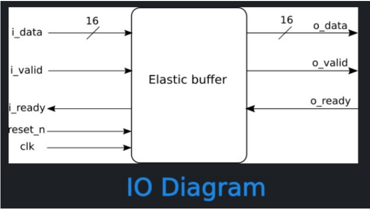

# Elastic buffer
## _Eridan pre-screening_

## Overview

- Elastic buffer is a module that helps transfer data between devices
- Single clock domain
- Handles ready valid handshake
- Input data is of variable width and is set on instantiation
- Reset is synchronous and active on LOW

## IO Diagram

## Pin - out

| Signal name             | Type | Description                                         |
| ----------------------- | ---- | --------------------------------------------------- |
| clk                     | I    | Data clock used with i_data input and o_data output |
| rst_n                   | I    | System reset active LOW                             |
| i_valid                 | I    | Validity of input data                              |
| i_data [DATA_WIDTH : 0] | I    | Input data                                          |
| i_ready                 | O    | Readiness of buffer to accept new data              |
| o_valid                 | O    | Validity of output data                             |
| o_data [DATA_WIDTH : 0] | O    | Output data                                         |
| o_ready                 | I    | Readiness of output to accept new data              |

## Functional Description

Buffer is receiving variable width of data and is set at instantiation. 

Except data, buffer has two more input signals, i_valid and o_ready. Buffer will receive new data only when i_valid signal is set HIGH. Then, from the next clock cycle, he is ready to send it and awaits o_ready signal. In same clock cycle when o_ready is received, and buffer holds valid data, that data is sent. When sending valid data, o_valid signal must be set HIGH as well. 

In cycle when buffer has valid data to send, but o_ready signal is LOW i_ready must be set LOW as well, for buffer is not yet ready to accept new data. When that data is sent, i_ready is set back to HIGH.

Reset is active LOW and initialize all output signals to 0.